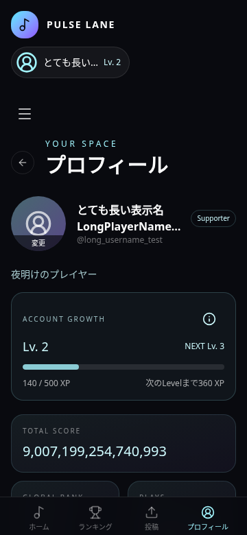
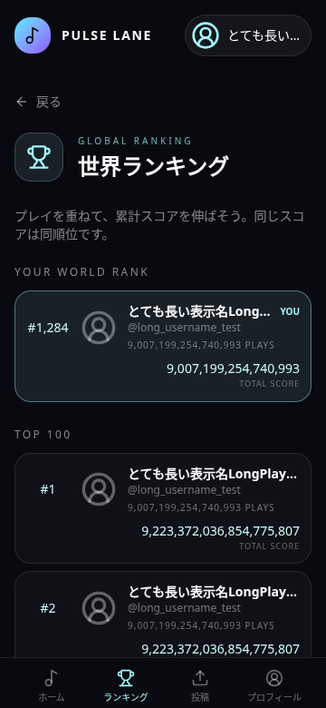
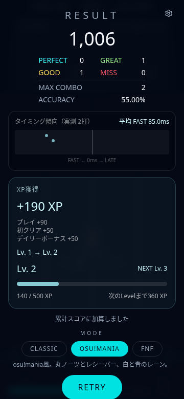
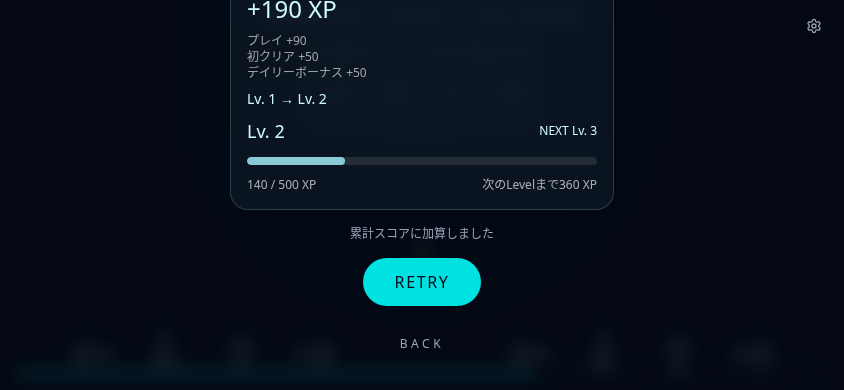
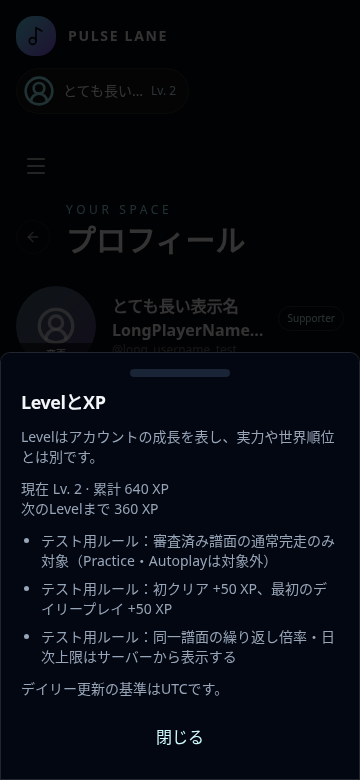
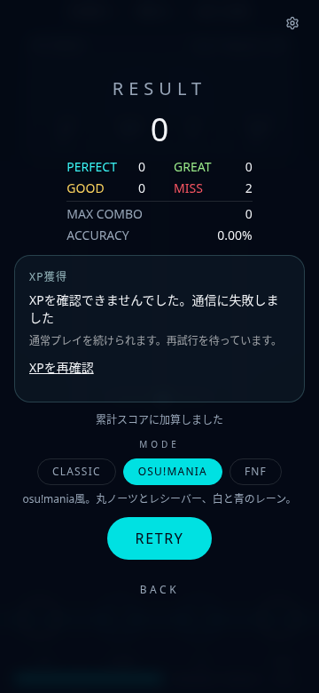
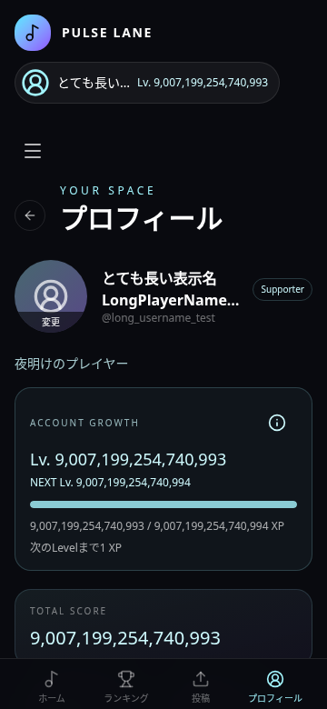

# ランキング信頼性と成長UIの確認記録（2026-10-10）

PR #1 と #2 はマージ済み。最新 main `cde94be` から差分修正した。
楽曲投稿、FNFの左右メタデータ、判定タイミング、スコア計算は変更していない。

## 修正したファイル

- `src/lib/playResultQueue.ts`: v1キューをv2へ移行。ユーザー・UUIDごとの個別キーにして別タブの保存で他の結果を消さない。通信失敗は同じUUIDで2秒から最大60秒の間隔で再送。認証・未適用RPCなどの恒久的エラーは自動再送停止、入力不正は削除して次の結果を処理。送信中のRETRYで追加された結果も処理。保存済みUUIDの再描画・再登録を抑制。storage利用不可時は現在タブのメモリへ保持し、その制限を表示する。
- `src/lib/playerRanking.ts`: 取得した本人セッションのBearer tokenをリクエストに固定。別アカウントへの切替で以前のスコアを送らない。送信タイムアウトは15秒。Practiceの競技保存を防ぐ。
- `src/lib/usePlayResult.ts`: 自動再送、別タブの変更通知、保存後の統計更新、ユーザーごとの表示状態、恒久的エラーの再試行停止。
- `src/components/game/GameScreen.tsx`: 即BACK／RETRY前にも保存待ちへ確保。保存状態とXP状態を分離。storage失敗・入力拒否の説明。RESULTのsafe-area、スクロール、44px以上のBACK／再試行操作領域。
- `src/components/app/RankingScreen.tsx`: スマホは各行のTOTAL SCOREを独立行にし、長い名前とBIGINTを読みやすくする。自分のYOU表示を名前の省略と分離。データなしを架空の0点と扱わない。既存のDBによるTop 100・同点順位・本人順位取得は維持。
- `src/components/app/RhythmHub.tsx`: アバター・名前・@usernameを統計より上へ移動。長い名前は2行まで（全文はtitle属性）。スマホのTOTAL SCORE全幅、その下GLOBAL RANK／PLAYSの2列を維持。編集と投稿コンテンツを保持。
- `src/components/app/AccountGrowth.tsx`、`src/lib/accountGrowth.ts`: サーバー確定値専用の成長UIと表示契約。プロフィールは称号→全幅XPカード→競技統計→別Supporterカード。ホームはアカウント表示内の小さなLv。RESULTは従来の判定情報より下、操作ボタンより上の独立XPカード。説明はPC Dialog／スマホBottom Sheet。本人の成長表示と公開表示の許可を分離。XP Boostの表示は初期OFF。XPの再取得通知もUUIDごとに一度に抑制し、Levelアップ演出は繰り返さないようアニメーションを設けていない。
- `supabase/migrations/20261010120000_play_result_validation.sql`: 下記のDB検証。
- `tests/`: 保存キュー、アカウント切替、DB、ランキング、成長表示の意味のある回帰テスト。

## DB migration：本番は適用していない

既存の設定が指す Lovable Cloud endpoint に publishable key でアクセスした。
`GET /rest/v1/`、`POST /rest/v1/rpc/get_global_leaderboard` は403（edge error 1010）。
管理接続、service-role key、DB password は環境に設定されておらず、
認証済みユーザー接続もない。実スキーマとmigration履歴は取得できなかった。
既存DB・データは変更していない。別の本番DBも作成していない。

既存プロジェクトの管理者が `supabase migration list --linked` またはそのmigration管理画面で
適用履歴を確認し、**未適用のファイルだけ**をこの順番で適用する必要がある。

1. `supabase/migrations/20261006200000_global_score_ranking.sql`
2. `supabase/migrations/20261007090000_global_score_ranking_hardening.sql`
3. `supabase/migrations/20261010120000_play_result_validation.sql`（今回追加）

履歴のないDBを確認なしで「未適用」と決めず、SQL editorで次の読み取りも行う。

```sql
select to_regclass('public.play_results'), to_regclass('public.player_stats');
select routine_name, data_type from information_schema.routines
where routine_schema = 'public' and routine_name in
  ('record_play_result', 'get_global_leaderboard', 'get_player_ranking', 'validate_play_result');
select policyname, tablename, cmd from pg_policies
where schemaname = 'public' and tablename in ('play_results', 'player_stats');
select version from supabase_migrations.schema_migrations order by version;
```

RPCのBIGINT返却型、列権限、トリガーも適用履歴と照合する。migration履歴と実物が
一致しない場合は先にその差を解消する。適用済みファイルの再実行は禁止。
今回のmigrationは既存履歴を変更・削除せず、新規INSERTだけを検証する。

検証はRPCと直接INSERTに共通のBEFORE INSERT triggerで実施する。
負数・NULL・NaN・不正accuracy・到達できないmax combo・現在のcombo bonusで
到達できないスコアを拒否する。max combo計算はBIGINTでoverflowを防ぐ。
同一UUIDは元の本人と不変payloadが一致する場合のみ既存保存を確認する。
他人の履歴登録、統計の直接変更、履歴変更／削除、日時の指定、anonによる登録を拒否する。

これはブラウザ申告値の整合性検証である。譜面の真正性・選択側の実ノーツ数・
実際の入力時刻・人間のプレイは証明できない。サーバーが信頼する譜面とreplayを
照合する機能は別途必要。実行可能な偽プレイの完全防止は実装していない。

## XP／Supporter：UIのみ準備、本番は無効

リポジトリ全体と最新mainにはXP付与RPC・XP台帳・Level計算式・審査条件・
繰り返し倍率・日次上限・Supporter連携・Level公開設定の保存処理が存在しない。
そのため今回これらの値やルールを推測して追加していない。
本番ルートにはenabledな `AccountGrowthProvider` を接続していないので、
プロフィール・ホーム・RESULTに仮のXP／Level／Supporterカードは表示されない。

将来の接続には、同じプレイUUIDで冪等なサーバーXP台帳、元ユーザーに紐づく再取得API、
実ルールと公開設定の保存処理が必要。`AccountGrowthProvider` にサーバーのsnapshot・
rewards・rulesと、付与ではなく**確定結果を再取得する**refresh callbackを渡す。
保存待ちの完了時に同じユーザーの成長情報を再取得する通知を用意している。
数値・条件は必ず実際に適用するサーバールールを渡す。

UIはサーバーのLevel、次Level、累計XP、現在Level内XP、必要XPを使い、
累計XPから独自のLevel式で計算しない。BIGINTはdecimal textで受け取り、
BigIntで正確に表示する。残りXPとバーのみ現在Level内の値から算出する。
複数Levelアップもサーバー到達Levelを表示する。

公開非表示のUI条件はテスト済みだが、公開プロフィール画面と設定の永続保存は未実装。
サーバー実装・本番報酬付与・プロフィール／ホームへの本番反映は未確認であり、
XP機能全体の完了を意味しない。

## 実行した検証

- `npm test`: 8ファイル、68件成功。既存40件を含む。
- PGlite上で全migrationを適用。RLS・権限・trigger・RPC・二重加算防止・
  BIGINT文字列・同点・0点・Top 100外を検証。実engineで生成した120通りの
  空譜面／混合判定／MISS／長いcombo／combo bonus上限の正常結果を受理。
- TypeScriptとproduction buildが成功。
- 変更した全TS／TSXファイルのESLintはエラー・警告なし。
- 全体lintは変更前も後も349エラー／7警告。348エラーは既存の整形、
  1エラーは `src/integrations/supabase/previewAuthStorage.ts` の既存prefer-const。
  関係のないファイルは整形していない。
- Chromium 151／Playwrightで360×780、844×390、1440×900を確認。
  全画面のdocument scrollWidthがviewport幅以内。長い名前、大きなスコア、100行を確認。
- XPは有効化したテストproviderの**架空のサーバーfixture**でのみ確認。
  Level到達直前・ちょうど到達・複数LevelアップはDOMテスト。大きなLevel／XPは
  DOMテストに加え360px／844×390のブラウザでも確認。
  画面では付与完了・反映待ち・通信失敗・対象外、Dialog／Bottom Sheetを確認。
- 短いテスト譜面・実際のAudioClock／engineでmaniaとFNFを完走。
  キーボードDとブラウザのtouchscreen入力、RETRYの新UUID、BACKを確認。
  FNFは右側2ノーツのみを採点し、左側1ノーツを含めない。
  7回の完走で保存APIを7回、異なる7 UUIDで呼び出し。画面JS例外なし。
- ブラウザのDB／認証／報酬レスポンスはfixture。実アカウント、本番の譜面配信、
  Supabaseへの保存、実機iPhone／Safari／外部キーボードは未確認。
  既存内蔵曲の全曲完走・本番のFNF左右切替も今回のブラウザ確認には含めない。

## スクリーンショット

以下はローカルの実コンポーネント。XP／Supporterはテストproviderのfixtureであり、
本番で付与された値ではない。RETRY／BACKはスクロールで到達できる。

| プロフィール 360px | ランキング 360px |
| --- | --- |
|  |  |

| RESULT mania 360px | FNF横画面：スクロール後の操作 |
| --- | --- |
|  |  |

| XP説明Bottom Sheet | XP通信失敗 |
| --- | --- |
|  |  |



## 公開への次の操作

1. このPRをレビューしてmainへ通常マージ（force push／履歴書換えは行わない）。
2. 既存Lovable Cloud／Supabaseプロジェクトで上記履歴とスキーマを照合し、未適用migrationのみ適用。
3. 認証済み実アカウントでmania／FNFの保存、即BACK／RETRY、offline→reload→online、
   アカウント切替、順位更新を本番DBに対して確認する。
4. Lovable同期内容を確認し、通常のPublishで公開する。本作業では公開・mainマージは行っていない。
5. XPを有効にする前に、サーバー付与ルール・冪等台帳・公開設定を実装してproviderを接続し、
   実アカウント／端末で改めて検証する。現時点ではXPは無効のまま公開可能。
